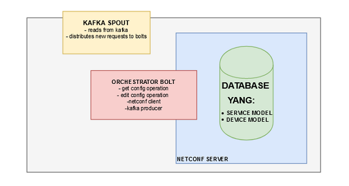

# NEtwork Node ADministrator (NENAD)

## INTRODUCTION

NENAD is an orchestrator that enables a netconf API for the Open Kilda controller. It provides a Network Wide Transaction.

### COMPONENTS

* Orchestrator: The "brain" of the NENAD.
* Netconfspeaker: Southbound API for netconf devices.

### ARCHITECTURE 

**Orchestrator overview:**



* Storm topology 
* Database (for more info - device3/README.md):
    * Sysrepo  
    * Netopeer2
* Netconf client 

The orchestrator part is inside the Storm. It reads an request and decides which action to use (explained later). 

All the communication is done either through Kafka (Kilda - Orchestrator and Orchestrator - Netconfspeaker) or via the netconf protocol (Orchestrator - DB and Netconfspeaker - devices)

**Netconfspeaker overview:**


* Kafka consumer
* Kafka producer
* Netconf client

The netconfspeaker provides an ALL or NOTHING transaction. This means that you can talk with multiple devices inside one request and if any of the devices configuration fails - they all fail!

### WORKFLOW

Open Kilda talks with the orchestrator in a form of a JSON request via Kafka. 

Example of an "edit-config" request from Open Kilda:

```
{
    "request":{
        "operation":"edit-config",
        "transaction-id":"100",
        "l1":[
            {"value":"123"}
        ],
        "devices":{
            "device":[
                {
                    "name": "device1",
                    "address": "192.0.0.1",
                    "port":"22",
                    "config":{
                        "router":{
                            "router-id":"192.3.3.3",
                            "bgp":{
                                "as-number":"123456",
                                "neighbors":[
                                    {
                                        "id":"192.4.4.4",
                                        "remote-as": 111111
                                    }
                                ]
                            }
                        }
                    }
                }
            ]
        }
    }
}
```
The Orchestrator then sends an JAVA object which contains information about the nature of the action, device(s) information (address, port, credentials) and the configuration parameters (edit-config case).

**GET CONFIG**

> kafka -> spout -> bolt -> sysrepo -> bolt -> kafka

The get-config request never leaves the Storm part. The DB(sysrepo) is supposed to contain all the running configurations of the connected devices. Finally it sends the config to Open Kilda via Kafka.


**EDIT CONFIG**

>kafka -> spout -> bolt -> sysrepo -> bolt -> kafka
>
>kafka -> netconfspeaker -> device(s) -> netconfspeaker -> kafka

The edit-config request is a bit more complicated than that. It still talks to the DB, but only to fetch the credentials and to later compare the existing configuration in the DB and the actual configuration on the device. If they missmatch the request is stoped and an error is sent back. Else the "ok" message is sent via Kafka back to Storm for further processing. After the request is finished, a "ok" message is sent to Open Kilda via Kafka.


### PIPELINE

- [ ] testing (unit, integration, system)
- [ ] ADD devices (seperate workflow)
- [ ] services (service to device mapping)
- [ ] check-sync (timestamp, unique ID, config hash)
